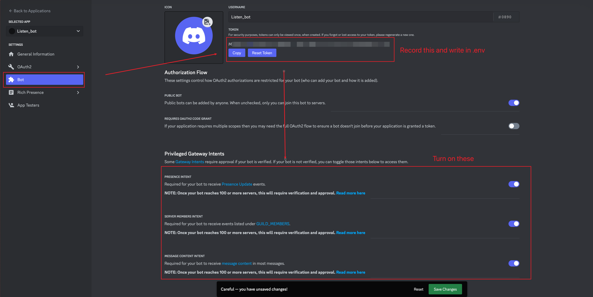
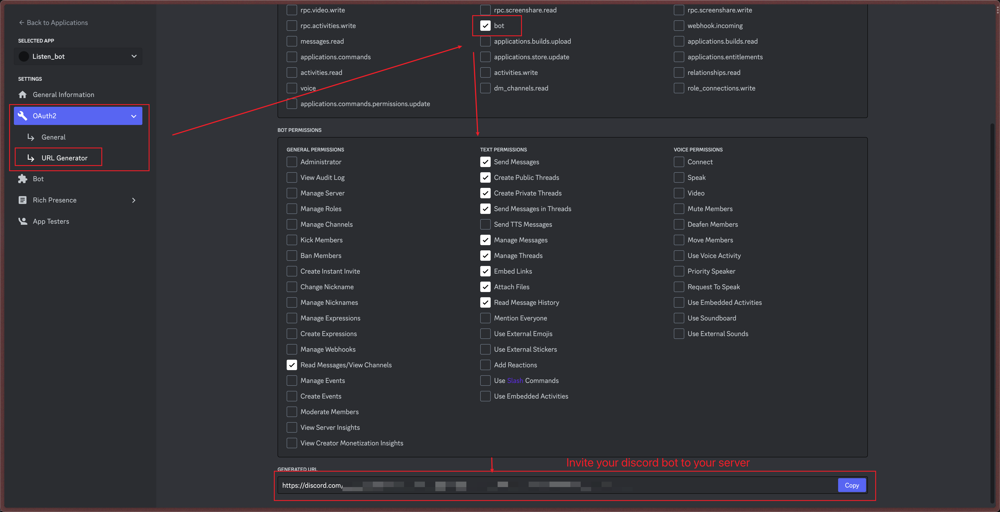
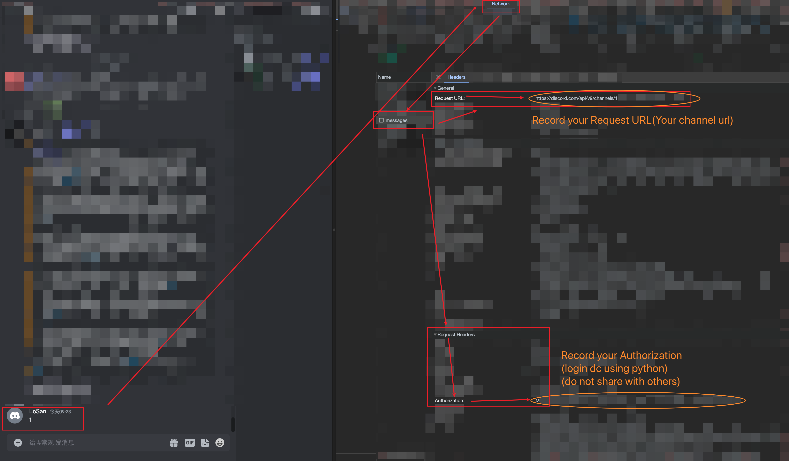

# Perplexity AI in Raycast

## Step 1

please use the following command to create a Python environment named venv:

```
python3 -m venv venv
source venv/bin/activate
pip install -r requirements.txt
```

Clone this repo and configure your discord bot token in the .env file. It is recommended to use a discord alt account. This repo is for technical reference and learning only.

Please refer to [Discord Developer Applications](https://discord.com/developers/applications). Create a new application here (new application), and then pull the bot into a discord server you created.

Please ensure that the discord bot has the permission to read channel information. In addition, you also need to go to the perplexity discord server and pull the perplexity bot into your own discord server [Perplexity Discord Server](https://discord.com/invite/perplexity-ai)




Log in to your discord alt account with a browser, open your channel interface, inspect the elements with the browser and go to the network. Then send a message at random. Afterwards, find messages, and record the request URL and authorization in Headers.



## Step 2

Put the discord_bot_tokens in the .env

Enter the local repo and open the terminal. First, run bot.py. The command is:

```
python bot.py
```

Then, do not close the terminal. It is used to listen to the replies from perplexityAI with your own bot.

Open a new terminal and navigate to the root directory of the current file.Next, run the following command:

```
npm run build && npm run dev
```

After successful setup, before asking a question in the future, you only need to keep the terminal running bot.py continuously. If interrupted, Raycast will not be able to render Perplexity's responses.

## Tips

- If you uninstall the plugin, the history will disappear. Therefore, the question history is only for temporary saving. It is recommended that during each learning process, if necessary, please save it to your PKM or other note-taking tools.
- In the ```ask-perplexity.tsx``` code file, the path to the Python virtual environment and the ```app.py``` file are specified on lines 18 and 24 respectively. You should modify these to the **absolute paths** on your system. And the path to the `answer.txt` file is specified on line 46. You should modify this to the absolute path on your system. Here is the line for reference:
  - Here are the lines for reference:
    ```
    pythonPath: '<absolute_path_to_your_venv>/bin/python', // Modify your Python path here.
    ```
    ```
    scriptPath: '<absolute_path_to_your_app.py>', // Modify your app.py path here.
    ```
    ```
    const answerPath = '<absolute_path_to_your_answer.txt>'; // Modify your answer.txt path here.
    ```
- Once the Raycast Extension is installed, it does not need to be installed again. However, ```bot.py``` needs to be continuously running in the background to listen. Therefore, please ensure it is running before using the plugin.
